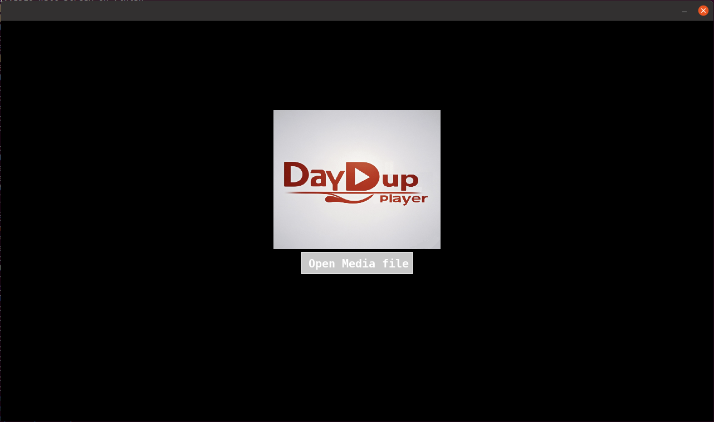
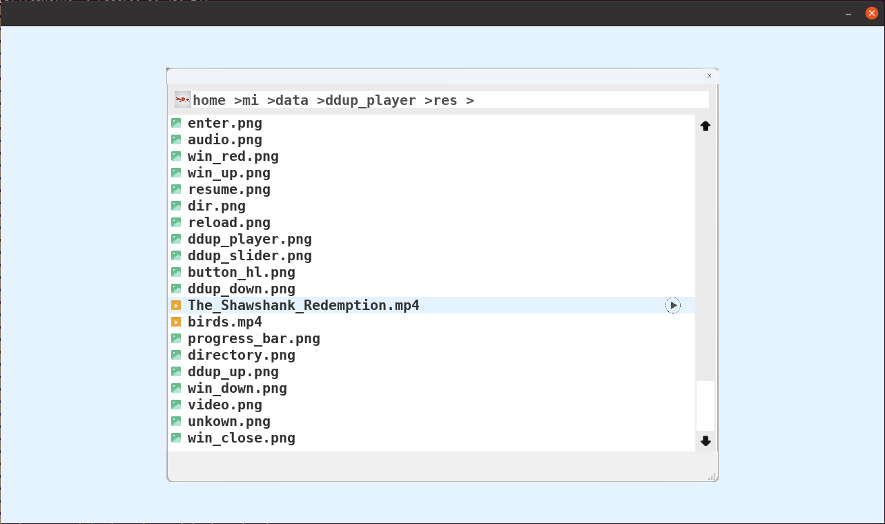
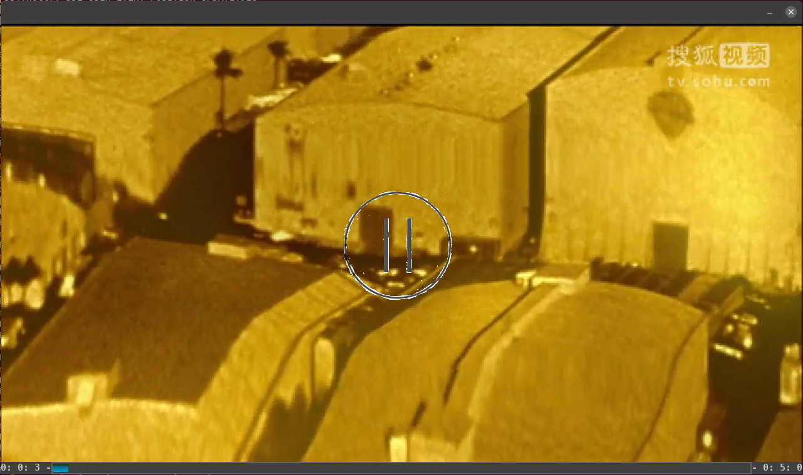

# dependencies
```
sudo apt install cmake
sudo apt install g++
sudo apt install libsdl2-dev
sudo apt-get install libsdl2-image-dev
sudo apt-get install libsdl2-ttf-dev
```

# build
```
cmake -G "Unix Makefiles" -B build  -DCMAKE_INSTALL_PREFIX=build  -DCMAKE_BUILD_TYPE=Debug
cd build
make
make install
```

#run
```
export LD_LIBRARY_PATH=${your_path}/ddup_player/third_party/ffmpeg-7.0.1/lib:$LD_LIBRARY_PATH
cd ${your_path}/ddup_player/build/result
./ddup_app
```






# tools 
## auto format codes
  ```
  ./tools/auto_format.sh
  ```
## generate docs
  ```
  ./tools/generate_doxygen_docs.sh
  ```
  you can open the file `./docs/html/index.html` in your browser or use `xdg-open ./doc/html/index.html` to see the docs.


